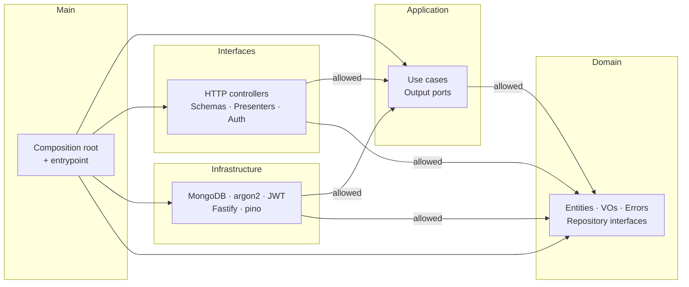

# Quanos

Public + admin API for managing and following configured **links**. Built as a reference implementation of **Clean Architecture in Node.js + TypeScript** on top of **MongoDB**, packaged as an **OCI container**, deployable via **Docker** and **Kubernetes**.

> Built against the brief: a public visitor browses and jumps to configured links; an admin logs in and creates / updates / deletes them.

---

## What's in here

| Layer             | Lives in              | Depends on           |
| ----------------- | --------------------- | -------------------- |
| Domain            | `src/domain/`         | nothing              |
| Application       | `src/application/`    | domain               |
| Interfaces (HTTP) | `src/interfaces/`     | application + domain |
| Infrastructure    | `src/infrastructure/` | application + domain |
| Composition root  | `src/main/`           | every layer          |

The dependency rule (outer → inner only) is mechanically enforced at lint-time by [`eslint-plugin-boundaries`](https://github.com/javierbrea/eslint-plugin-boundaries) **and** in CI by [`dependency-cruiser`](https://github.com/sverweij/dependency-cruiser). Any reverse import fails the build.



For more detail, see [`docs/architecture.md`](docs/architecture.md) and the six ADRs under [`docs/adr/`](docs/adr/).

---

## Run it (pick one)

Three end-to-end runbooks. Each is copy-paste-runnable; the only thing you need installed is what's at the top of each block. After the stack is up, see [Verifying the security fixes](#verifying-the-security-fixes-env-agnostic) for one-curl-per-feature smoke tests.

### Local dev (npm + Mongo container)

Requires Node 22 (use `nvm use` to match `.nvmrc`) and Docker.

```bash
# 1. Mongo in a throwaway container
docker run -d --rm --name quanos-mongo-dev -p 27017:27017 mongo:7

# 2. App with dev defaults inline
npm ci
MONGO_URI=mongodb://localhost:27017 \
JWT_SECRET=dev-jwt-secret-not-for-production-32chars \
JWT_AUDIENCE=quanos-admin \
ADMIN_USERNAME=admin ADMIN_PASSWORD='test-admin-pw-1234' \
npm run dev
# → "mongo connected, indexes ensured" then "app listening"
```

API on `localhost:3000`, ops/health on `localhost:3001`. Tear down:

```bash
docker rm -f quanos-mongo-dev
```

### Docker Compose

Requires Docker. Test creds are baked into [`deploy/docker-compose.yml`](deploy/docker-compose.yml) — no env setup needed.

```bash
docker compose -f deploy/docker-compose.yml up --build -d
docker compose -f deploy/docker-compose.yml logs -f app   # ctrl-c to stop tail
```

API on `localhost:3000`, ops on `localhost:3001`. Default admin password is `test-admin-pw-1234`. Override before any non-local deploy via host env (`JWT_SECRET=… docker compose …`) or a `deploy/.env` file (compose auto-loads it).

Tear down:

```bash
docker compose -f deploy/docker-compose.yml down -v
```

### Kubernetes (kind / minikube)

Requires Docker, `kind` (or `minikube`), and `kubectl`.

```bash
# 0. Cluster (skip if you already have one)
kind create cluster --name quanos

# 1. Build the image and load it into the cluster's containerd
docker build -f deploy/docker/Dockerfile -t quanos:dev .
kind load docker-image quanos:dev --name quanos

# 2. Set real values in deploy/k8s/overlays/dev/secret.yaml first.
#    JWT_SECRET >= 32 chars, ADMIN_PASSWORD >= 8 chars, or the app refuses to boot.
kubectl apply -k deploy/k8s/overlays/dev
kubectl -n quanos-dev rollout status deploy/quanos --timeout=120s

# 3. Reach the API. Service exposes port 80 → container 3000.
kubectl -n quanos-dev port-forward svc/quanos 3000:80 3001:3001 &
```

Use whatever password you set in `secret.yaml` for login. The dev overlay patches `imagePullPolicy: IfNotPresent` so the locally-loaded image is used (kind's containerd doesn't share Docker's image cache).

Tear down:

```bash
kind delete cluster --name quanos
```

### Verifying the security fixes (env-agnostic)

The same curls work in all three environments — change the host URL if you're not on localhost. Match `PW` to the password the chosen environment uses.

```bash
PW='test-admin-pw-1234'   # local dev / docker compose default; use whatever you set for k8s
TOKEN=$(curl -s -X POST http://localhost:3000/v1/auth/login \
  -H 'content-type: application/json' \
  -d "{\"username\":\"admin\",\"password\":\"$PW\"}" | jq -r .token)

# JWT audience claim (M1) — token has three dot-separated segments
echo "$TOKEN" | tr '.' '\n' | wc -l   # 3

# Schema rejects javascript: URL scheme (M4)
curl -s -o /dev/null -w '%{http_code}\n' -X POST http://localhost:3000/v1/admin/links \
  -H "authorization: Bearer $TOKEN" -H 'content-type: application/json' \
  -d '{"title":"x","url":"javascript:alert(1)"}'              # 422

# Click count is gated on isActive (M3)
LID=$(curl -s -X POST http://localhost:3000/v1/admin/links \
  -H "authorization: Bearer $TOKEN" -H 'content-type: application/json' \
  -d '{"title":"a","url":"https://anthropic.com"}' | jq -r .id)
curl -s -o /dev/null http://localhost:3000/go/$LID
curl -s http://localhost:3000/v1/admin/links/$LID -H "authorization: Bearer $TOKEN" | jq .clickCount   # 1
curl -s -X PUT http://localhost:3000/v1/admin/links/$LID \
  -H "authorization: Bearer $TOKEN" -H 'content-type: application/json' \
  -d '{"isActive":false}' >/dev/null
curl -s -o /dev/null http://localhost:3000/go/$LID
curl -s http://localhost:3000/v1/admin/links/$LID -H "authorization: Bearer $TOKEN" | jq .clickCount   # still 1

# Pagination + X-Total-Count (S9)
for i in 1 2 3 4 5; do
  curl -s -X POST http://localhost:3000/v1/admin/links \
    -H "authorization: Bearer $TOKEN" -H 'content-type: application/json' \
    -d "{\"title\":\"L$i\",\"url\":\"https://e.com/$i\",\"displayOrder\":$i}" >/dev/null
done
curl -is 'http://localhost:3000/v1/links?limit=2&offset=1' | grep -i x-total-count   # 5
```

For the JWT-verifier error-discrimination fix (S3), tail the app logs and hit an admin endpoint with a tampered token:

```bash
# local dev: in the npm-run-dev shell
# docker compose: docker compose -f deploy/docker-compose.yml logs -f app
# k8s:           kubectl -n quanos-dev logs -f deploy/quanos
curl -s -o /dev/null http://localhost:3000/v1/admin/links \
  -H "authorization: Bearer ${TOKEN}garbage"
# expect a "jwt verify failed" log line with reason="invalid"
```

### Other npm scripts

| Script                     | What it does                                         |
| -------------------------- | ---------------------------------------------------- |
| `npm run lint`             | ESLint flat config + boundaries plugin               |
| `npm run typecheck`        | `tsc --noEmit` (strict + exactOptionalPropertyTypes) |
| `npm run format:check`     | Prettier                                             |
| `npm run depcruise`        | Dependency-cruiser layering check                    |
| `npm run test`             | All tests (e2e + integration; needs Docker)          |
| `npm run test:integration` | Integration tests only                               |
| `npm run test:e2e`         | E2E tests only                                       |
| `npm run test:coverage`    | All tests + coverage gate                            |
| `npm run openapi:generate` | Writes `docs/openapi.yaml` from the Zod schemas      |
| `npm run openapi:check`    | CI gate — fails if a schema changed without regen    |
| `npm run build`            | tsup → `dist/index.js` (single ESM bundle, ~50 KB)   |
| `npm run dev`              | tsx watch mode                                       |

---

## Configuration

All settings come from environment variables. **A missing required var fails the boot with a list of every issue, not just the first.** Loader: [`src/infrastructure/config/env.ts`](src/infrastructure/config/env.ts).

> The four credential vars below default to dev-only values so the runbooks above work without setup. **Production deploys must override them** via env, `.env`, or a Kubernetes Secret.

| Variable                 | Required? | Default                                         | Notes                                                         |
| ------------------------ | --------- | ----------------------------------------------- | ------------------------------------------------------------- |
| `MONGO_URI`              | no        | `mongodb://localhost:27017`                     | **override in prod**                                          |
| `JWT_SECRET`             | no        | `dev-secret-please-change-me-in-production-now` | ≥32 chars; **override in prod**                               |
| `ADMIN_USERNAME`         | no        | `admin`                                         | ≥3 chars                                                      |
| `ADMIN_PASSWORD`         | no        | `change-me-please`                              | ≥8 chars; **override in prod**                                |
| `NODE_ENV`               | no        | `development`                                   | `development` \| `production` \| `test`                       |
| `LOG_LEVEL`              | no        | `info`                                          | `debug` \| `info` \| `warn` \| `error` \| `fatal` \| `silent` |
| `PORT`                   | no        | `3000`                                          | API port                                                      |
| `OPS_PORT`               | no        | `3001`                                          | health-probe port                                             |
| `MONGO_DB_NAME`          | no        | `quanos`                                        |                                                               |
| `MONGO_TIMEOUT_MS`       | no        | `5000`                                          | server-selection timeout                                      |
| `JWT_TTL_SECONDS`        | no        | `3600`                                          | token lifetime                                                |
| `JWT_ISSUER`             | no        | `quanos`                                        | `iss` claim                                                   |
| `JWT_AUDIENCE`           | no        | `quanos-admin`                                  | `aud` claim — verifier rejects mismatches                     |
| `RATE_LIMIT_MAX`         | no        | `100`                                           | requests per window                                           |
| `RATE_LIMIT_TIME_WINDOW` | no        | `1 minute`                                      | parsed by `@fastify/rate-limit`                               |
| `CORS_ORIGINS`           | no        | (none)                                          | comma-separated; `*` = any                                    |
| `REQUEST_ID_HEADER`      | no        | `x-request-id`                                  | echoed back to clients                                        |

---

## API

### Routes

| Method | Path                  | Auth         | Notes                                                                                       |
| ------ | --------------------- | ------------ | ------------------------------------------------------------------------------------------- |
| GET    | `/go/:id`             | —            | 302 redirect + atomic click increment. 404 if inactive.                                     |
| GET    | `/v1/links`           | —            | List active. `?limit=1..200&offset=0..` opt-in pagination; `X-Total-Count` response header. |
| GET    | `/v1/links/:id`       | —            | Public get. 404 if inactive.                                                                |
| POST   | `/v1/auth/login`      | —            | Returns `{ token, expiresAt }`.                                                             |
| GET    | `/v1/admin/links`     | Bearer       | List **all** (incl. soft-deleted). Same pagination as the public list.                      |
| GET    | `/v1/admin/links/:id` | Bearer       | Get any status.                                                                             |
| POST   | `/v1/admin/links`     | Bearer       | Create → 201.                                                                               |
| PUT    | `/v1/admin/links/:id` | Bearer       | Partial update. `description: null` clears.                                                 |
| DELETE | `/v1/admin/links/:id` | Bearer       | Soft-delete → 204. Re-activate via `PUT { isActive: true }`.                                |
| GET    | `/healthz`            | — (ops port) | Liveness — never touches Mongo.                                                             |
| GET    | `/readyz`             | — (ops port) | Readiness — pings Mongo with hard timeout.                                                  |

### OpenAPI

The full spec lives at [`docs/openapi.yaml`](docs/openapi.yaml). It's **generated from the same Zod schemas** the runtime validator uses (single source of truth) — paste it into [editor.swagger.io](https://editor.swagger.io) for a UI, or import into Postman/Insomnia.

CI runs `npm run openapi:check`: if a developer edits a Zod schema and forgets to regenerate, the workflow fails.

---

## Deployment notes

The image is **~60 MB**, runs as **non-root UID 65532**, on `gcr.io/distroless/nodejs22-debian12:nonroot` with `tini` as PID 1. Build details in [`docs/adr/0006-distroless-runtime-image.md`](docs/adr/0006-distroless-runtime-image.md).

Kustomize layout under `deploy/k8s/`:

```
base/                  Deployment, Service, ConfigMap, HPA, PDB,
                       NetworkPolicy, ServiceAccount
overlays/dev/          1 replica, dev secret, dev Mongo, drops the NetworkPolicy
                       (kindnet doesn't enforce egress NPs reliably),
                       sets imagePullPolicy=IfNotPresent for kind/minikube
overlays/prod/         3 replicas, Ingress + cert-manager, expects
                       `quanos-secret` from External Secrets / Vault
```

The prod overlay deliberately ships **no Secret** — `kubectl apply -k overlays/prod` won't start until `quanos-secret` exists in the namespace. That's the desired property: a half-configured prod deploy never boots.

**Pod hardening** (verifiable via `kubectl describe`):

- `runAsNonRoot: true`, `runAsUser: 65532`, `seccompProfile: RuntimeDefault`
- `allowPrivilegeEscalation: false`, `readOnlyRootFilesystem: true`, `capabilities.drop: [ALL]`
- `automountServiceAccountToken: false`
- Liveness on `/healthz` (no Mongo dependency), readiness on `/readyz` (Mongo ping with 1s timeout), startup probe with 60s window

**Debugging the distroless container** — no shell in the runtime image, so use ephemeral debug containers:

```bash
kubectl debug -n quanos-dev --image=busybox --target=app pod/<name>
```

---

## CI/CD

Workflows under [`.github/workflows/`](.github/workflows/):

- **`ci.yml`** — runs on every PR + push to `main`. Six parallel jobs: lint + format + boundaries + OpenAPI freshness, typecheck, full test suite (unit + integration + e2e + coverage gate), gitleaks + Trivy filesystem scan, multi-arch image build (PRs validate, `main` pushes to GHCR), informational image scan with SARIF upload.
- **`release.yml`** — runs on `v*` tags. Re-runs the full gate, builds multi-arch image with semver tags, **cosign keyless-OIDC signs** the image, generates an **SPDX SBOM** and cosign-attests it, creates a GitHub Release.
- **`dependabot.yml`** — weekly grouped updates for npm (patch+minor grouped, major separate), Docker base images, GitHub Actions versions.

**Coverage gates** (enforced in `vitest.config.ts`): ≥75% lines, statements, and functions; ≥70% branches.

---

## Architecture decisions

Each ADR follows the Michael Nygard template (Status / Context / Decision / Consequences).

| #                                                      | Decision                                         |
| ------------------------------------------------------ | ------------------------------------------------ |
| [0001](docs/adr/0001-clean-architecture.md)            | Clean Architecture (4 layers + composition root) |
| [0002](docs/adr/0002-typescript-and-esm.md)            | TypeScript strict + native ESM via NodeNext      |
| [0003](docs/adr/0003-fastify-over-express.md)          | Fastify v5 over Express                          |
| [0004](docs/adr/0004-mongodb-driver-over-mongoose.md)  | Native `mongodb` driver over Mongoose            |
| [0005](docs/adr/0005-zod-as-single-source-of-truth.md) | Zod for validation **and** OpenAPI generation    |
| [0006](docs/adr/0006-distroless-runtime-image.md)      | Distroless `nodejs22-debian12:nonroot` runtime   |

---

## License

MIT — see [`LICENSE`](LICENSE).
