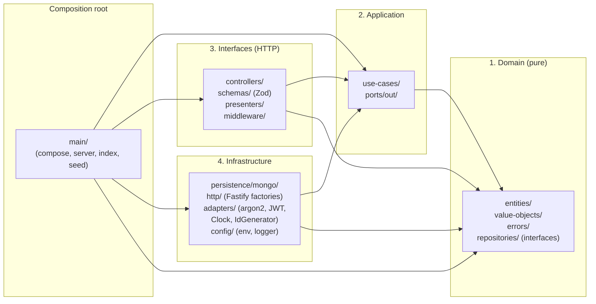
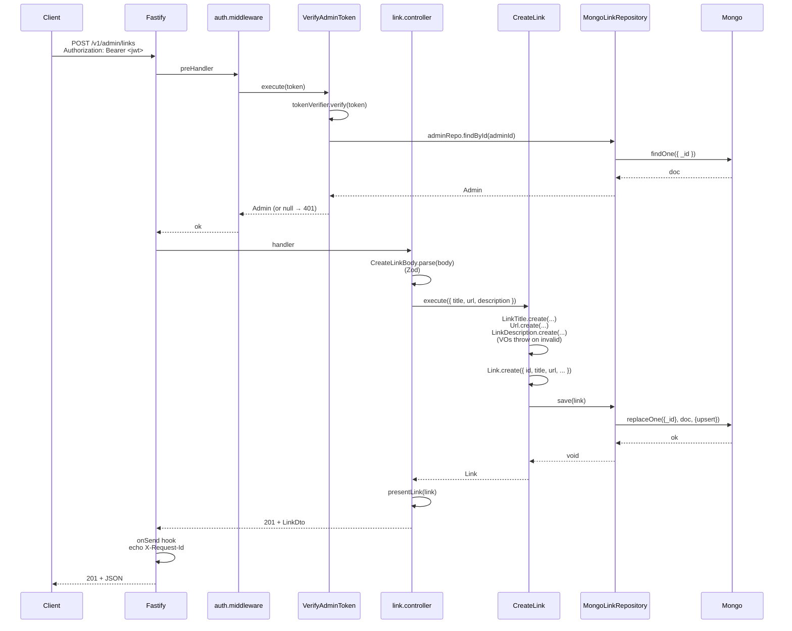
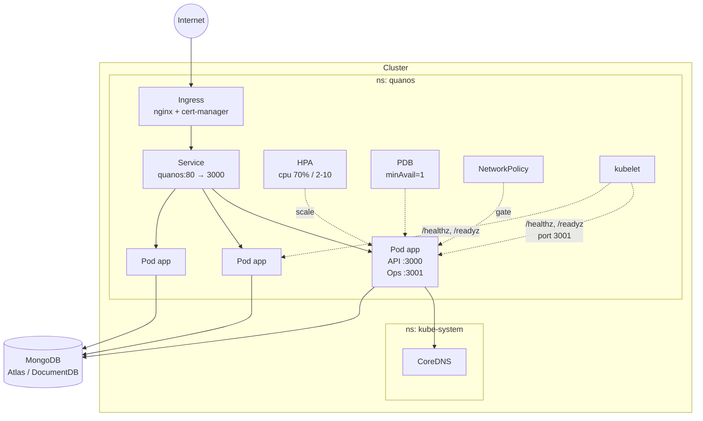

# Architecture

Quanos is a Clean Architecture implementation in Node.js + TypeScript. Four concentric layers + a composition root; the dependency rule (outer → inner only) is enforced both at lint-time (`eslint-plugin-boundaries`) and in CI (`dependency-cruiser`).

---

## Layers



| Layer                | What lives here                                                                                                                                         | Allowed imports      |
| -------------------- | ------------------------------------------------------------------------------------------------------------------------------------------------------- | -------------------- |
| **Domain**           | `Link`, `Admin`, value objects (`Url`, `LinkTitle`, `Username`, `PasswordHash`, …), domain errors, **repository interfaces**                            | nothing else         |
| **Application**      | Use cases (`CreateLink`, `JumpToLink`, `AuthenticateAdmin`, …), output ports (`Clock`, `IdGenerator`, `PasswordHasher`, `TokenSigner`, `TokenVerifier`) | domain               |
| **Interfaces**       | Fastify controllers, Zod request/response schemas, presenters, auth middleware                                                                          | application + domain |
| **Infrastructure**   | Mongo repository implementations, argon2id hasher, HS256 JWT signer/verifier, Fastify server factory, pino, env loader                                  | application + domain |
| **Composition root** | `compose.ts` wires everything; `server.ts` boots; `index.ts` is the entrypoint with graceful shutdown; `seed-admin.ts` is idempotent admin bootstrap    | every layer          |

### Why the application layer doesn't return DTOs

Use cases return **domain entities** (e.g. `Link`, `Admin`), not "application DTOs". The HTTP presenter does entity → JSON mapping at the edge. The trade-off: the interfaces layer can `import type { Link }` from the domain, which is fine because that import direction is allowed. Returning a separate plain DTO from every use case would be ~30% more code for negligible safety gain, given that the type system already guarantees the entity contract.

---

## A request through the layers

Sequence for `POST /v1/admin/links` (admin creates a link):



If any step throws a `DomainError` (`InvalidUrlError`, `InvalidTitleError`, …), Fastify's error handler maps the `code` field to a status (422 for invalid input, 401 for any auth-shaped error, 404 for not-found). `ZodError` from the body parse becomes 422 with a structured `issues` array.

### Click-tracking is atomic on the repository, not on the entity

`Link` deliberately does **not** expose `incrementClickCount()` on the entity. Concurrent jumps to the same link in a read-modify-write loop would race; the safe path is a single atomic write at the repository:

```ts
// MongoLinkRepository.incrementClickCount
await this.collection.updateOne(
  { _id: id.value },
  { $inc: { clickCount: 1 }, $currentDate: { updatedAt: true } },
);
```

Verified in the integration suite by 25 concurrent increments landing exactly 25.

---

## Deployment topology



The **ops port (3001)** is intentionally **not exposed via a Service** — kubelet probes hit the pod IP directly, so there's no need to route ops traffic through kube-proxy. If you want Prometheus-style metrics scraping later, add a separate `ClusterIP` for port 3001 with a `monitoring: true` label and let the NetworkPolicy ingress rule allow it.

---

## Where to look first

| Question                                              | File                                                                                             |
| ----------------------------------------------------- | ------------------------------------------------------------------------------------------------ |
| "How does it all fit together?"                       | `src/main/compose.ts` — every adapter and use case is `new`-ed up here, top to bottom.           |
| "What's the canonical persistence contract?"          | `src/domain/repositories/link.repository.ts`                                                     |
| "What does the use-case shape look like?"             | `src/application/use-cases/create-link.use-case.ts` (every other use case follows this template) |
| "Where is the dependency rule mechanically enforced?" | `eslint.config.js` (`eslint-plugin-boundaries`) and `.dependency-cruiser.cjs`                    |
| "What does the production artifact look like?"        | `deploy/docker/Dockerfile` (4-stage, distroless + tini, non-root)                                |
| "How do probes/security/policy work in K8s?"          | `deploy/k8s/base/deployment.yaml`                                                                |
